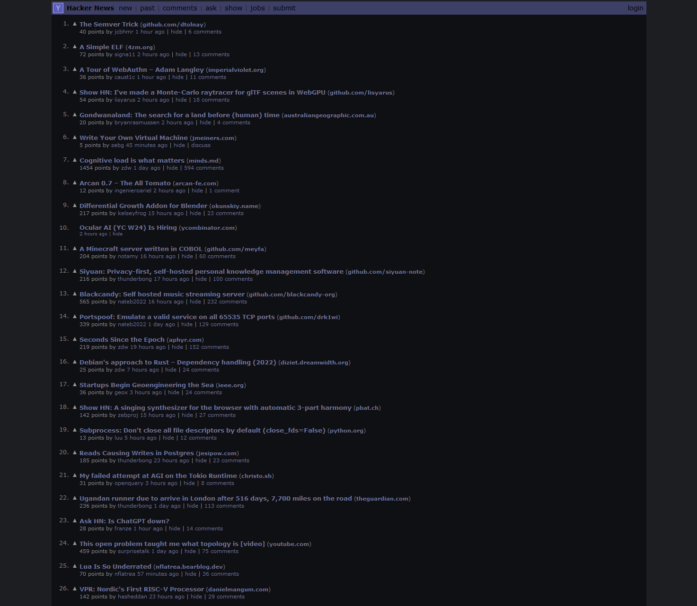
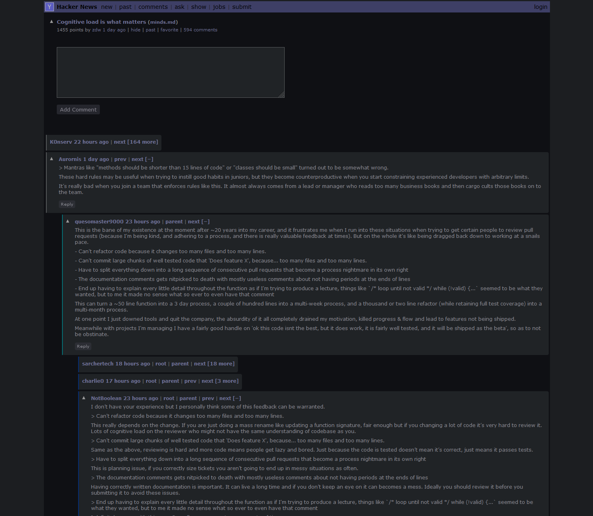

<h3 align="center">
    
     
    A dark theme for night time readers of Hacker News
</h3>

<h4 align="center">
    
    
     
     
    <i>Preview</i>
</h4>

### :art: Palette

|  | Color | Hex | RGB | HSL |
|---|------|-----|-----|-----|
|  | Purple | `#707299` | `rgb(112, 114, 152)` | `hsl(237, 16%, 52%)` |
|  | Blue   | `#3e3f66` | `rgb(62, 63, 102)` | `hsl(239, 24%, 32%)` |
|  | Dark Blue | `#33353D` | `rgb(51, 53, 61)` | `hsl(238, 9%, 22%)` |
|  | Gray 100 | `#D3D1DE` | `rgb(211, 209, 222)` | `hsl(249, 16%, 85%)` |
|  | Gray 200 | `#8c8b94` | `rgb(140, 139, 148)` | `hsl(247, 4%, 56%)` |
|  | Gray 300 | `#ffffff66` | `rgba(255, 255, 255, 0.4)` | `hsla(0, 0%, 100%, 0.4)` |
|  | Gray 400 | `#ffffff44` | `rgba(255, 255, 255, 0.27)` | `hsla(0, 0%, 100%, 0.4)` |
|  | Gray 500 | `#202326` | `rgb(32, 35, 38)` | `hsl(210, 9%, 14%)` |
|  | Gray 600 | `#1c1e21` | `rgb(28, 30, 33)` | `hsl(216, 8%, 12%)` |
|  | Black | `#0f1014` | `rgb(15, 15, 20)` | `hsl(228, 14%, 7%)` |

### :electric_plug: Installation

#### Pre-requisites 

This theme is implemented as a userscript and will require a userscript managing browser extension to run.

##### Userscript Managers
- [ViolentMonkey](https://violentmonkey.github.io/)
- [TamperMonkey](https://www.tampermonkey.net/)

_Note: I wrote and tested this script using ViolentMonkey_

#### Installing the userscript

Click one of the links below and your userscript manager will prompt you to install the script.
- [GitHub](https://raw.githubusercontent.com/LocalPrimate/midnight-hacker-news/refs/heads/main/script/midnight-hacker-news.user.js)
- [GreasyFork](https://update.greasyfork.org/scripts/521898/Midnight%20Hacker%20News.user.js)
